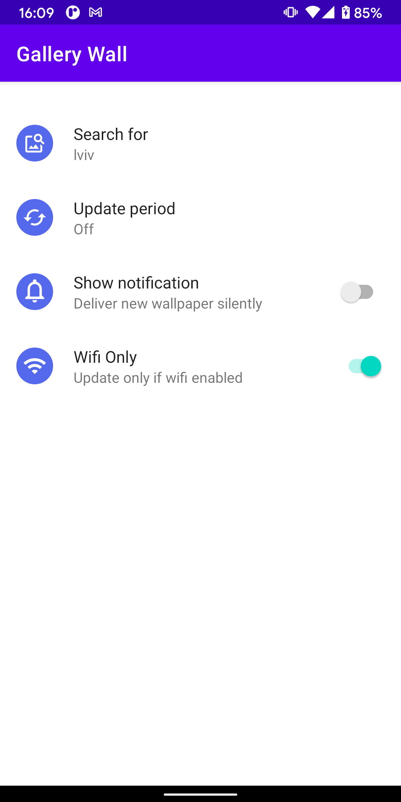
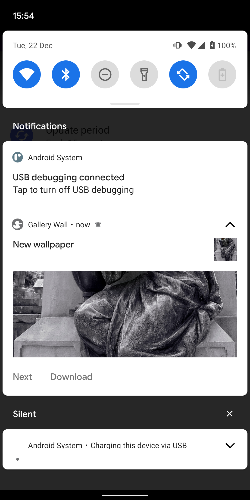
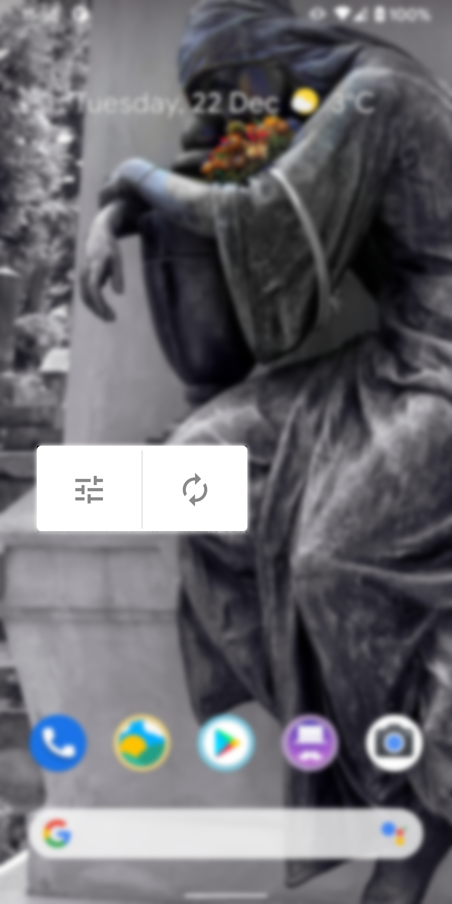

# GalleryWall

[](https://github.com/bossly/gallerywall/actions)
[](https://github.com/bossly/gallerywall/tags)
[](https://android-arsenal.com/api?level=26)
[](https://play.google.com/store/apps/details?id=com.baysoft.gallerywall)

|  |  |  |
|-|-|-|

Android application to refresh your wallpaper with in duration that can be set in settings. Each wallpaper picture comes from the free source following the any topic that been typed as search query.

It's optimized for the low battery usage using latest system's API.

# Setup 

Currently there only Pixabay service used to fetch wallpaper images.

Edit `local.properties` with your api key from https://pixabay.com/service/about/api/


```groovy
api_pixabay=<your api key>
```

# References

* [4pda](http://4pda.ru/forum/index.php?showtopic=158065&st=2660#entry29540977) - 21/02/2014
* [http://androidforums.com](https://androidforums.com/threads/free-automation-wallpaper-switcher.831706/#post6458208) - 25/02/2014
* [reddit: AppHunt](https://www.reddit.com/r/AppHunt/comments/l66fjs/gallerywall_automated_wallpaper/)
* [reddit: fossdroid](https://www.reddit.com/r/fossdroid/comments/l66has/apache_20_gallerywall_opensourced_automated/)
* [reddit: androidapps](https://www.reddit.com/r/androidapps/comments/l628f4/gallerywall_opensourced_automated_wallpaper_app/)
