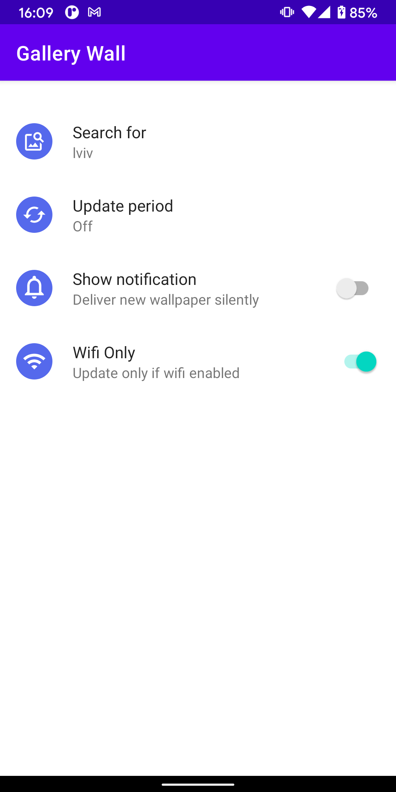
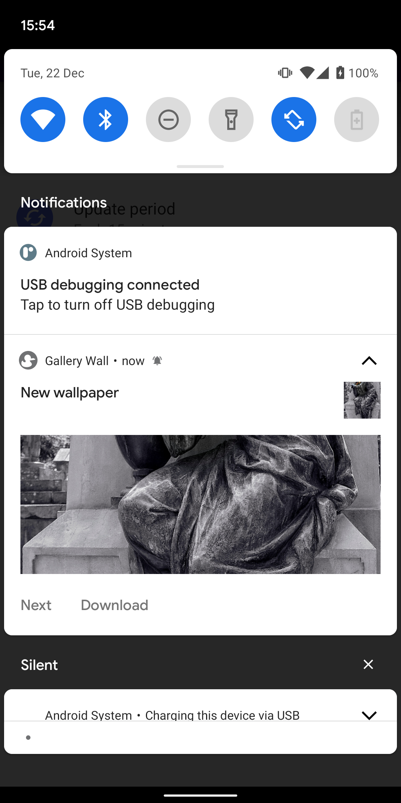
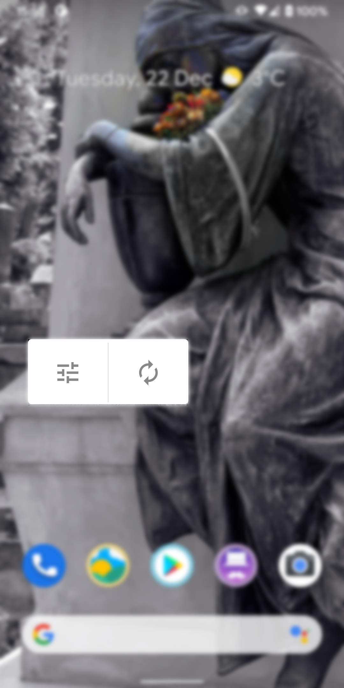

# GalleryWall

|  |  |  |
|-|-|-|

Android application to refresh your wallpaper on an interval you choose in settings.

 Wallpapers are generated on device based on activated plugins on the **Providers** tab.
 
 Default plugins:
 - **Solid color**
 - **Gradient** 

Plugins to be downloaded as Dynamic Feature Module:
- Image tile generator
- Wallpaper with smiles
- 

It's optimized for low battery usage using the system WorkManager APIs.

# References

* [4pda](http://4pda.ru/forum/index.php?showtopic=158065&st=2660#entry29540977) - 21/02/2014
* [http://androidforums.com](https://androidforums.com/threads/free-automation-wallpaper-switcher.831706/#post6458208) - 25/02/2014
* [reddit: AppHunt](https://www.reddit.com/r/AppHunt/comments/l66fjs/gallerywall_automated_wallpaper/)
* [reddit: fossdroid](https://www.reddit.com/r/fossdroid/comments/l66has/apache_20_gallerywall_opensourced_automated/)
* [reddit: androidapps](https://www.reddit.com/r/androidapps/comments/l628f4/gallerywall_opensourced_automated_wallpaper_app/)

# Refactoring

ideas from:
 https://github.com/patzly/doodle-android
 https://github.com/you-apps/WallYou
 
 
I would like to have app that update my wallpaper with generated images. 
Application should have 3 tabs: 
- Recents - recently generated wallpapers grouped by date and can be filtered by #provider

- Providers - list of providers that can be downloaded to the phone and used locally. Providers will be listed on github
- Automation - settings for automation to change wallapaer based on time and entry prompt

https://github.com/rmatif/Local-Diffusion
https://f-droid.org/packages/com.openstablediffusion/
https://dev.to/alichherawalla/how-to-generate-ai-images-locally-on-your-android-phone-in-2026-no-cloud-no-subscription-2g4j

fix:
APK app-debug.apk is not compatible with 16 KB devices. Some libraries have LOAD segments not aligned at 16 KB boundaries:
lib/arm64-v8a/libstable-diffusion.so

----

To run a local AI image generator on Android for 64x64 pixel art, the most efficient architecture is a lightweight TensorFlow Lite model using a custom GAN or a small Diffusion model (like a downscaled Unet). Large models like Stable Diffusion are too slow and resource-heavy for mobile, but a dedicated 64x64 model can generate sprites locally in milliseconds.

## 🛠️ Core Tech Stack

* Model Runtime: TensorFlow Lite.
* Model Type: Tiny GAN (Generative Adversarial Network) or a mini Diffusion model trained on pixel art.
* App Development: Kotlin using Android Studio.

------------------------------
## 📋 Step-by-Step Implementation Guide

## 1. Export the Model to Mobile Format
You must first train or download a 64x64 model in Python using Keras/TensorFlow, then convert it to a mobile-friendly TFLite format.

# Python snippet to export a Keras model to TensorFlow Lite for Android
import tensorflow as tf
model = TinyPixelArtGAN() # Your 64x64 trained model
# Convert and save the model
converter = tf.lite.TFLiteConverter.from_keras_model(model)
tflite_model = converter.convert()
with open("pixel_art_model.tflite", "wb") as f:
    f.write(tflite_model)

## 2. Set Up Your Android Project
Add the necessary TensorFlow Lite dependency to your app's build.gradle file:

dependencies {
    implementation("org.tensorflow:tensorflow-lite:2.14.0")
}

Place your exported pixel_art_model.tflite file directly into your project's app/src/main/assets/ directory.

## 3. Run Inference Locally in Kotlin
Load the model into memory, generate a random noise vector, and run the forward pass to output the 64x64 image grid.

import org.tensorflow.lite.Interpreter
// 1. Load the model from assets
val interpreter = Interpreter(loadModelFileFromAsset(context, "pixel_art_model.tflite"))
// 2. Generate random noise (latent vector) and label as inputs
val noiseInput = Array(1) { FloatArray(100) { java.util.Random().nextFloat() } }
val labelInput = Array(1) { IntArray(1) { 0 } }
// 3. Run the model to get a 64x64x3 output
val outputBuffer = Array(1) { Array(64) { Array(64) { FloatArray(3) } } }
val inputs = arrayOf(noiseInput, labelInput)
val outputs = mapOf(0 to outputBuffer)
interpreter.runForMultipleInputsOutputs(inputs, outputs)

## 4. Convert Tensor Data to a Pixel-Perfect Bitmap
Because pixel art loses its crisp quality when stretched, you must convert the raw float array into an Android Bitmap and disable anti-aliasing during rendering.

// Convert the [1][64][64][3] float array into color pixels
val pixels = IntArray(64 * 64)
for (y in 0 until 64) {
    for (x in 0 until 64) {
        val i = y * 64 + x
        val r = ((outputBuffer[0][y][x][0] + 1f) * 127.5f).toInt().coerceIn(0, 255)
        val g = ((outputBuffer[0][y][x][1] + 1f) * 127.5f).toInt().coerceIn(0, 255)
        val b = ((outputBuffer[0][y][x][2] + 1f) * 127.5f).toInt().coerceIn(0, 255)
        pixels[i] = (0xFF shl 24) or (r shl 16) or (g shl 8) or b
    }
}
// Create the native 64x64 Bitmap
val bitmap = Bitmap.createBitmap(pixels, 64, 64, Bitmap.Config.ARGB_8888)

## 5. Display Without Blurring
To scale the 64x64 sprite onto a high-resolution phone screen without making it blurry, force the UI to use Nearest Neighbor scaling.

* Jetpack Compose: Use FilterQuality.None inside your Image composable.
* XML Views: Use a custom drawable wrapper or a canvas scale with paint.isAntiAlias = false.

# NEW features

## Material 3 Expressive

update Schedule Interval for Automation by using Slider to numbers

## Support for tablet and TV

## Support Car 

## Resolve dependencies

APK app-debug.apk is not compatible with 16 KB devices. Some libraries have LOAD segments not aligned at 16 KB boundaries:
lib/arm64-v8a/libtensorflowlite_jni.so
Starting November 1st, 2025, all new apps and updates to existing apps submitted to Google Play and targeting Android 15+ devices must support 16 KB page sizes. For more information about compatibility with 16 KB devices, visit developer.android.com/16kb-page-size.

# update button 

## Screen to apply image filter for output wallpaper
- black & white
- sepia
- invert colors
- blur

## Tile settings:
- scale
- grid lines
- checkerboard pattern
- random color noise
- blend tiles
- border color
- rotate
- 
